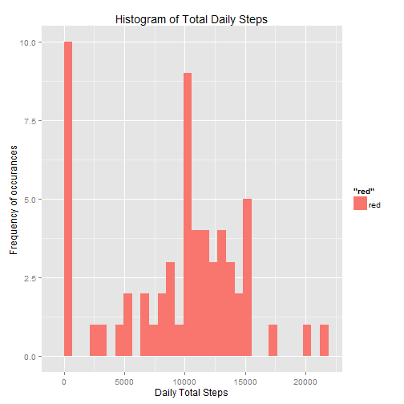
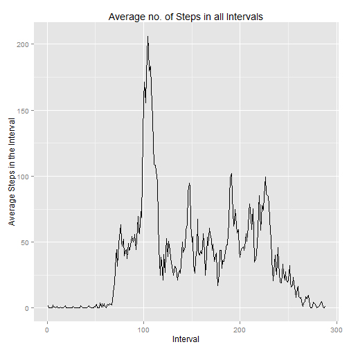
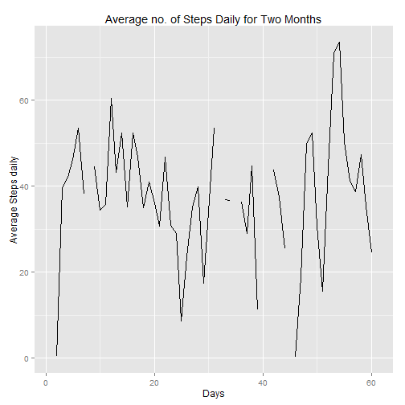
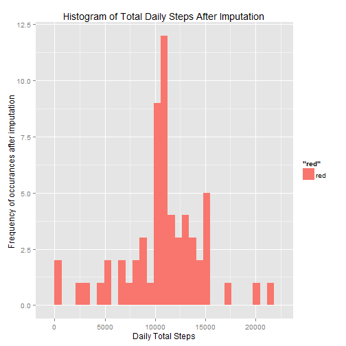
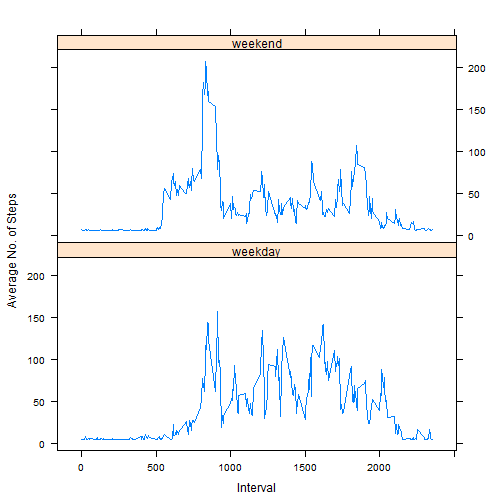

Activity Monitoring Devices
========================================================


## Loading and preprocessing the data
The entire dataset of steps data is loaded into the variable called steps_data in the following:


```r
steps_data <- read.csv("./repdata-data-activity/activity.csv")
```


## Mean total number of steps taken per day

Following code computes "PerDay" calculations for each date given in the dataset. Daywise sums, means and medians for steps are calculated and stored in the variable "datewise". Then, histogram of daywise sums of steps is plotted with ggplot2 library.


```r
StepSumsPerDay = tapply(steps_data$steps, steps_data$date, sum, na.rm = TRUE)  ## Calculating Daily Sums
StepMeansPerDay = tapply(steps_data$steps, steps_data$date, mean, na.rm = TRUE)  ## Calculating Daily Means
StepMediansPerDay = tapply(steps_data$steps, steps_data$date, median, na.rm = TRUE)  ## Calculating Daily Medians

datewise = data.frame(cbind(StepSumsPerDay, StepMeansPerDay, StepMediansPerDay))  ## Merging above three in a single dataframe
colnames(datewise) = c("Sums", "Means", "Medians")
library(ggplot2)
qplot(Sums, data = datewise, geom = "histogram", fill = "red", xlab = "Daily Total Steps", 
    ylab = "Frequency of occurances ", main = "Histogram of Total Daily Steps")
```

 

```r
overall_mean_of_sums = mean(datewise$Sums, na.rm = T)
overall_median_of_sums = median(datewise$Sums, na.rm = T)
```


The overall mean of the total number of steps taken per day is 9354.2295.  
Similarly median is 1.0395 &times; 10<sup>4</sup> 


## Average daily activity pattern


```r
steps_data$interval = as.factor(steps_data$interval)
StepMeansPerInterval = data.frame(tapply(steps_data$steps, steps_data$interval, 
    mean, na.rm = TRUE))
colnames(StepMeansPerInterval) = "IntervalMeans"
StepMeansPerInterval$x = 1:288
ggplot(StepMeansPerInterval, aes(x = x, y = IntervalMeans)) + geom_line() + 
    xlab("Interval") + ylab("Average Steps in the Interval") + ggtitle("Average no. of Steps in all Intervals")
```

 

```r

max_interval = names(which.max(StepMeansPerInterval$IntervalMeans))
```

The above plot shows the average number of steps in an interval across all days.  
Following plot will show average number of steps daily across all intervals.

```r
datewise$Days = 1:61
ggplot(datewise, aes(x = Days, y = Means)) + geom_line() + xlab("Days") + ylab("Average Steps daily") + 
    ggtitle("Average no. of Steps Daily for Two Months")
```

 


The Interval which has the maximum average value of number of steps is 835

## Imputing missing values

Replacing missing values in the variable "new_data"" with the average of the whole dataset.

```r
missing = is.na(steps_data$steps)
steps_data$interval = as.numeric(as.character(steps_data$interval))
# Replacing missing values with the average of whole dataset.
new_data = steps_data
new_data$steps[missing] <- mean(new_data$steps, na.rm = T)
```

The total number of missing values before imputing in the dataset are 2304   

In the following code, calculating the number of steps taken each day.


```r
newSumsPerDay = data.frame(tapply(new_data$steps, new_data$date, sum, na.rm = TRUE))
colnames(newSumsPerDay) = "new_Sums"
qplot(new_Sums, data = newSumsPerDay, geom = "histogram", fill = "red", xlab = "Daily Total Steps", 
    ylab = "Frequency of occurances after imputation ", main = "Histogram of Total Daily Steps After Imputation")
```

 

```r
new_mean = mean(newSumsPerDay$new_Sums, na.rm = T)
new_median = median(newSumsPerDay$new_Sums, na.rm = T)
```


The values of mean and median after imputation are 1.0766 &times; 10<sup>4</sup> and 1.0766 &times; 10<sup>4</sup> respectively.  
They are different than the previous value and are slightly higher.
## Are there differences in activity patterns between weekdays and weekends?

In the following code, creating new factor variables - "Weekday" and "weekend." Then, plotting the required graph after doing some computations. 


```r
new_data$weekday = weekdays(as.Date(strptime(new_data$date, "%Y-%m-%d")))
new_data$f = ifelse(new_data$weekday == "Sunday" | new_data$weekday == "Saturday", 
    "weekend", "weekday")
new_data$f = factor(new_data$f, labels = c("weekend", "weekday"))
library(lattice)
new_data$interval = as.factor(new_data$interval)
weekend = subset(new_data, f == "weekend")
weekend = data.frame(tapply(weekend$steps, weekend$interval, mean, na.rm = T))
weekday = subset(new_data, f == "weekday")
weekday = data.frame(tapply(weekday$steps, weekday$interval, mean, na.rm = T))
weekend$x = rownames(weekend)
weekday$x = rownames(weekday)
weekend$f = "weekend"
weekday$f = "weekday"
rownames(weekend) = 1:288
colnames(weekend) = c("Means", "x", "f")
rownames(weekday) = 1:288
colnames(weekday) = c("Means", "x", "f")
week = rbind(weekend, weekday)
week$f = factor(week$f, labels = c("weekday", "weekend"))
week$Means = as.numeric(week$Means)
week$x = as.numeric(week$x)
xyplot(Means ~ x | f, layout = c(1, 2), data = week, type = "l", xlab = "Interval", 
    ylab = "Average No. of Steps")
```

 


